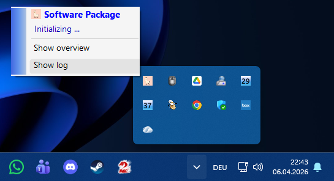
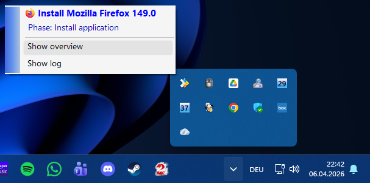
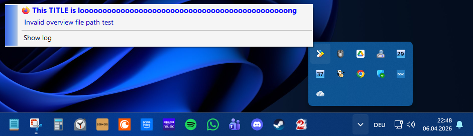
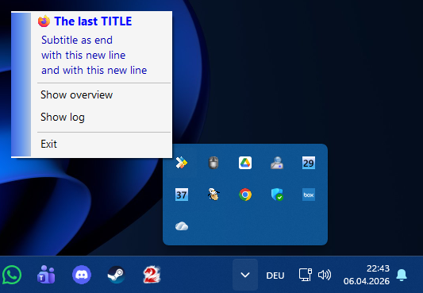
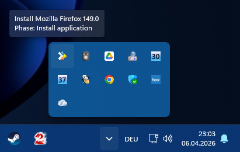

# PSTrayIcon
Powershell functions to create and control a tray icon for windows

- Fast data transfer via small 5kb memory space block, no disk reading or writing, no windows registry using as cache
- Secure data space with ACL security
- Async data writing and reading actions in own threads, not blocking the main procedure and making dynamic updates available
- Client part in a new process with own self closing logic after a defined timeout
- Good overview with one main function and handy parameters and two supporting function to control memory mapped files (mmf) for inter-process communication
- Simple logging and console output for tests integrated

## Main function parameters
**Set-TrayIconState**

Short description: 
Displaying a tray icon with updating values.

Long description: 
Displaying a tray icon in the windows tray icon area (right side of the taskbar). 
The tray icon runs via a separate script (created by this function). Dynamic updates will be invoked asynchronously via a Runspace and MemoryMappedFile reading process. 
This function also acts as a sender writing asyncrouniously a SettingString in a MemoryMappedFile to update the values of the tray icon.

Parameters: 
- Action
  - DataType:                    String
  - Notes:                       Type of action (Start, Stop or Change)
- TrayIconTitle
  - Aliases:                     Title
  - DataType:                    String
- TrayIconSubtitle
  - Aliases:                     Subtitle
  - DataType:                    String
- TrayIconMenuTextOverviewFile
  - Aliases:                     MenuTextOverviewFile, MenuTextOverview, ButtonOverviewFile, ButtonOverview
  - DataType:                    String
- TrayIconMenuTextLogFile
  - Aliases:                     MenuTextLogFile, MenuTextLog, ButtonLogFile, ButtonLog
  - DataType:                    String
- TrayIconMenuTextExit
  - Aliases:                     MenuTextExit, ButtonExit
  - DataType:                    String
- TrayIconFilePathOverview
  - Aliases:                     FilePathOverview
  - DataType:                    String
  - Notes:                       Full path to the file 
								 If the path do not exist the tray icon will hide the button.
- TrayIconFilePathLog
  - Aliases:                     FilePathLog
  - DataType:                    String
  - Notes:                       Full path to the file 
								 If the path do not exist the tray icon will hide the button.
- TrayIconFilePathImage
  - Aliases:                     FilePathImage
  - DataType:                    String
  - Notes:                       Full path to the file 
								 If the path do not exist the tray show an error icon.
- TrayIconFilePathTitleImage
  - Aliases:                     FilePathTitleImage
  - DataType:                    String
  - Notes:                       Full path to the file 
								 If the path do not exist the tray icon will not show an icon on the left side of the title.
- TrayIconUserExitAllowed
  - Aliases:                     UserExitAllowed, UserExitEnabled
  - DataType:                    Boolean
  - Notes:                       Will hide the exit button to close the tray icon
- ClientScriptNoNewDataTimeoutInSeconds
  - Aliases:                     TimeoutInSeconds, Timeout
  - DataType:                    Int32
  - Notes:                       Seconds without a new timestamp from the memory mapped file channel (or a timestamp older than this amount of seconds)
- ClientScriptReadingPauseInSeconds
  - Aliases:                     PauseInSeconds, Pause
  - DataType:                    Int32
  - Notes:                       Seconds of pause without reading the memory mapped file channel
- ClientScriptTempDirectory
  - Aliases:                     TempDirectory, TempDir
  - DataType:                    String
  - Notes:                       Path to create the client part script to show the tray icon
- ClientScriptTempFileName
  - Aliases:                     TempFileName, TempFile
  - DataType:                    String
  - Notes:                       Filename of the client part script to show the tray icon
- ClientScriptLogCreation
  - Aliases:                     LogCreation, Log
  - DataType:                    Switch
  - Notes:                       Enable log file creation for the client part script (path like client part script)
- MmfName
  - Aliases:                     Name
  - DataType:                    String
  - Notes:                       Name of the MemoryMappedFile
- MmfScope
  - Aliases:                     Scope
  - DataType:                    String
  - Notes:                       Scope of the MemoryMappedFile (Global or Local)
- WriteHost
  - DataType:                    Switch
  - Notes:                       Writing information to the console while running
- PassThru
  - DataType:                    Switch
  - Notes:                       Returning the result of the MemoryMappedFile writer

Input: 
No pipeline input or default value accepted (will be arguments order).

Output: 
Boolean for success

## Preview
### Initialization example

### Firefox installation example

### Long title and invalid path example

### Multiple lines title example

### Mouseover example
